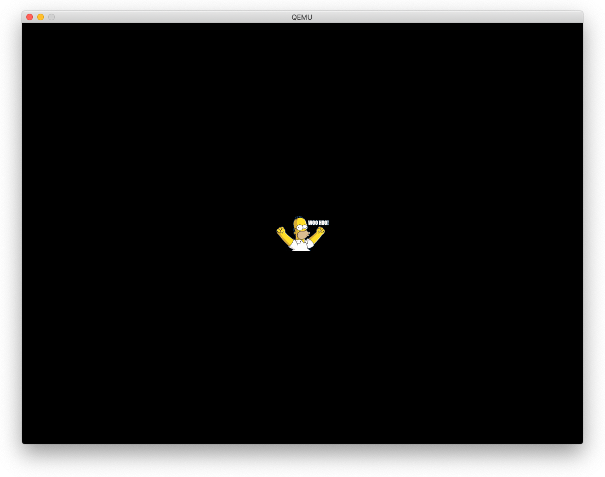

# チュートリアル09 - フレームバッファ

さて、最後に目の保養をしましょう :-) これまではスクリーンには虹のスプラッシュが
表示されていました。今回は、mbox_callにいくつかのタグを指定して解像度を変更し、
pixmapを表示します。タグと引数にはたくさんのコメントを付けましたので、lfb.cを
見てください。ただし、結局はint配列にデータを設定してmbox_callを呼び出すだけです。
実にシンプルです。試みにメッセージのタグを削除したり追加したりして何が起こるか
見てみましょう。なお、MBOX_CH_FB（FrameBufferチャンネル）を使うこともできますが、
MBOX_CH_PROPの方が柔軟性があります。

ピッチに関する重要な注意: ご存知ないかもしれませんが、ビデオスクリーンは必ずしも
ラスタラインをメモリ上に連続してマッピングしているわけではありません。たとえば、
各行の800ピクセル（800×4＝3200バイト）を4096バイトに格納することも可能です。
そのため、Y座標の位置を計算する際には、width * 4ではなく、ピッチ（行あたりのバイト数）を
問い合わせることが重要です。

また、Raspberry Piに搭載されているGPUは非常に強力であることに注意してください。
大きな仮想画面（仮に65536×768とします）を作れますが、一度に表示されるのは1024×768
ピクセルだけです。メールボックスメッセージを使えば、ピクセルバッファをコピーする
ことなく、ウィンドウを高速に移動させることができ、スムーズなスクロール効果を得る
ことができます。このチュートリアルでは、仮想スクリーンと物理スクリーンの両方を
1024x768に設定しています。

## lfb.h, lfb.c

`lfb_init()`は、解像度、深度、カラーチャネル順（RGBかBGBか）を設定します。また、
フレームバッファのアドレスを問い合わせます。

`lfb_showpicture()`は、フレームバッファにピクセルを描画することで、画面の中央に
画像を表示します。画像はRGBフォーマットであることに注意してください。lfbがそうで
ない場合は、RとBのチャネルを入れ替える必要があります。

## homer.h

gimpを使ってCのヘッダーファイルとして保存したpixmapです。無圧縮で1ピクセルずつ
保存されています。

## main
----

非常にシンプルです。解像度を設定して画像を表示する、それだけです。

## 実行結果

```
$ make
rm kernel8.elf *.o >/dev/null 2>/dev/null || true
aarch64-none-elf-gcc -Wall -O2 -ffreestanding -fno-stack-protector -nostdinc -nostdlib -nostartfiles -c start.S -o start.o
aarch64-none-elf-gcc -Wall -O2 -ffreestanding -fno-stack-protector -nostdinc -nostdlib -nostartfiles -c delays.c -o delays.o
aarch64-none-elf-gcc -Wall -O2 -ffreestanding -fno-stack-protector -nostdinc -nostdlib -nostartfiles -c lfb.c -o lfb.o
aarch64-none-elf-gcc -Wall -O2 -ffreestanding -fno-stack-protector -nostdinc -nostdlib -nostartfiles -c main.c -o main.o
aarch64-none-elf-gcc -Wall -O2 -ffreestanding -fno-stack-protector -nostdinc -nostdlib -nostartfiles -c mbox.c -o mbox.o
aarch64-none-elf-gcc -Wall -O2 -ffreestanding -fno-stack-protector -nostdinc -nostdlib -nostartfiles -c uart.c -o uart.o
aarch64-none-elf-ld -nostdlib -nostartfiles start.o delays.o lfb.o main.o mbox.o uart.o -T link.ld -o kernel8.elf
aarch64-none-elf-objcopy -O binary kernel8.elf kernel8.img

$ make run
qemu-system-aarch64 -M raspi3 -kernel kernel8.img -serial stdio
```




## メモ

- mbox[]に複数のタグを指定した場合、個々のリクエストの返事は該当タグのmbox[]に入る
- 描画の際には、各行ごとに(pitch(行あたりのバイト数) - 画像幅*4)で描画しない部分の補正をする
- homer.hはgimpのcヘッダー出力であるが、これは各pixelのRGBを(8*3=24bit)を6ビットずつ
  4つに分けて1文字とし、印刷可能文字にするため33を足す変換をしたもの（1ピクセルは4文字となる）
    - 0x000000 => "!!!!!!"
    - 0xff0000 => "'Q!!!!"
    - 0xffffff => "''''''"
