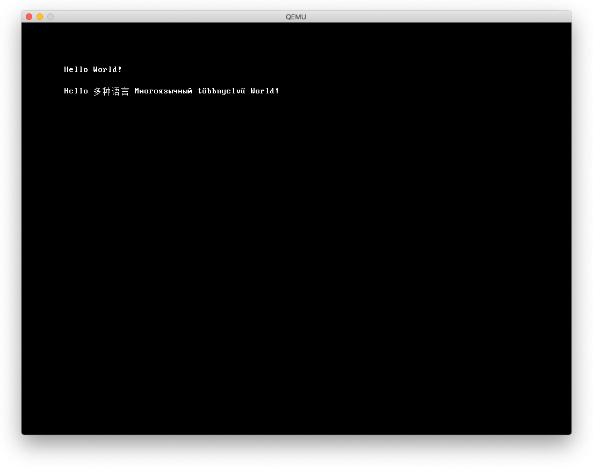

# チュートリアル 0A - PCスクリーンフォント

pixmapsを描くのも楽しいですが、やはり文字を表示する必要があります。基本的に
フォントは各文字のビットマップでしかありません。このチュートリアルでは
Linuxコンソールで使用されているものと同じPCスクリーンフォント形式を選択しました。

更新: リクエストが多かったので、UTF-8文字列を表示する方法のデモを追加しました。

## lfb.h, lfb.c


`lfb_init()`は、解像度、深度、カラーチャネル順（RGBかBGBか）を設定します。また、
フレームバッファのアドレスを問い合わせます。

`lfb_print(x,y,s)`は、PSFフォントを使って固定サイズのグリフでスクリーンに文字列を
表示します。

`lfb_proprint(x,y,s)`は、プロポーショナルなSSFNフォントを使ってスクリーンに文字列を
表示します。

## font.psf

フォントファイルです。/usr/share/kbd/consolefontsから任意のファイルを使用してください。
Unicodeテーブルには対応していません。（一対一の関係ではなく）テーブルを使って文字を
グリフインデックスに変換するのはあなたへの宿題です。このフォントは、オリジナルの
IBM PC VGA 8x16 フォント ROMから生成されたもので127 のグリフを含んでいます。

## font.sfn

PSFの最大の欠点の一つはグリフのメトリクスを保存しないことです。UTF-8文字列をサポート
するにはプロポーショナルフォントが必要になります(たとえば、ラテン文字には8x16ビットマップ、
CJKグリフには16x16ビットマップなど)。そこで、これに対応するために[スケーラブルスクリーンフォント](https://gitlab.com/bztsrc/scalable-font2)を
使用する方法のデモを追加しました。より詳しい情報、サンプルフォント、フォントコンバータは
SSFNリポジトリにあります。

## Makefile

psfフォントとsfnフォントから生成される2つのオブジェクトファイルを追加しました。これは
C言語でバイナリファイルをインクルード・参照する方法を示す良い例です。ラベルを
調べるために以下のコマンドを使いました。

```sh
$ aarch64-elf-readelf -s font_psf.o
        ... output removed for clearity ...
     2: 0000000000000820     0 NOTYPE  GLOBAL DEFAULT    1 _binary_font_psf_end
     3: 0000000000000000     0 NOTYPE  GLOBAL DEFAULT    1 _binary_font_psf_start
     4: 0000000000000820     0 NOTYPE  GLOBAL DEFAULT  ABS _binary_font_psf_size
```

## main

非常にシンプルです。解像度を設定して、最初はPSFフォンで、次いでSSFNフォントで
文字列を表示します。

## 実行結果

```
$ make
rm kernel8.elf *.o >/dev/null 2>/dev/null || true
aarch64-none-elf-gcc -Wall -O2 -ffreestanding -nostdinc -nostdlib -nostartfiles -c start.S -o start.o
aarch64-none-elf-ld -r -b binary -o font_psf.o font.psf
aarch64-none-elf-ld -r -b binary -o font_sfn.o font.sfn
aarch64-none-elf-gcc -Wall -O2 -ffreestanding -nostdinc -nostdlib -nostartfiles -c delays.c -o delays.o
aarch64-none-elf-gcc -Wall -O2 -ffreestanding -nostdinc -nostdlib -nostartfiles -c lfb.c -o lfb.o
aarch64-none-elf-gcc -Wall -O2 -ffreestanding -nostdinc -nostdlib -nostartfiles -c main.c -o main.o
aarch64-none-elf-gcc -Wall -O2 -ffreestanding -nostdinc -nostdlib -nostartfiles -c mbox.c -o mbox.o
aarch64-none-elf-gcc -Wall -O2 -ffreestanding -nostdinc -nostdlib -nostartfiles -c uart.c -o uart.o
aarch64-none-elf-ld -nostdlib -nostartfiles start.o font_psf.o font_sfn.o delays.o lfb.o main.o mbox.o uart.o -T link.ld -o kernel8.elf
aarch64-none-elf-objcopy -O binary kernel8.elf kernel8.img
dspace@mini:~/raspi_os/raspi3-tutorial/0A_pcscreenfont$ make run
qemu-system-aarch64 -M raspi3 -kernel kernel8.img -serial stdio
```



## めも

- font.sfnには日本語フォントは入ってなかった（サイズからすると、main.cで指定した文字だけか）
- とりあえずフォントの詳細は後回し
