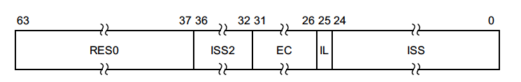
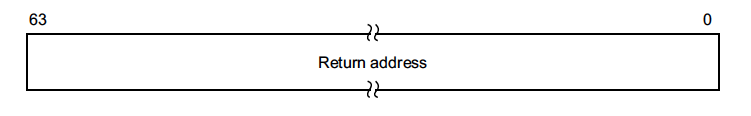
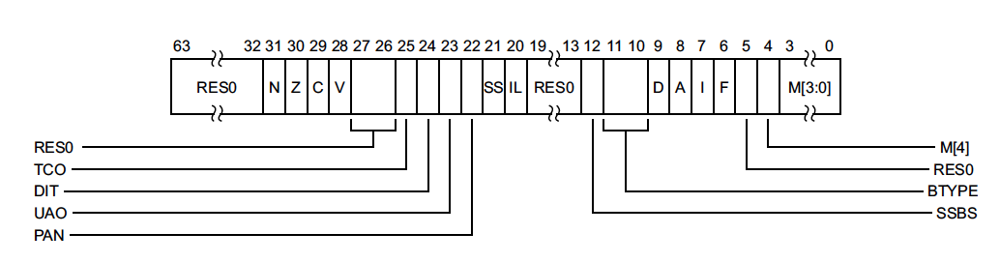
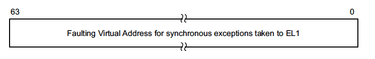

# チュートリアル 11 - 例外処理

前回は非常にシンプルな変換方式を使用しましたが、実際にはもっと多くのものが
必要になります。また、やみくもにテーブルを書くのは簡単ではないので、今回は
例外ハンドラを追加します。これはにいくつかのシステムレジスタを出力するので、
変換テーブルの問題点を特定することができます。

```sh
$ qemu-system-aarch64 -M raspi3 -kernel kernel8.img -serial stdio
Synchronous: Data abort, same EL, Translation fault at level 2:
  ESR_EL1 0000000096000006 ELR_EL1 0000000000080D7C
 SPSR_EL1 00000000200003C4 FAR_EL1 FFFFFFFFFF000000
```

ここでESR_EL1は、エラーがデータアボートであり、レベル2の変換テーブルエラーに
よって引き起こされたことを示しています。エラーの引き金となった命令はアドレス
0x80D7Cにあり、これは0xFFFFFFFFFF000000のメモリにアクセスしようとしました。

例外ベクタはAMD64のIDTと非常によく似ていますが、2つ例外があります。一つは、
（`sidt`のような）特別な命令はなく、システムレジスタにはアドレスを格納する
ことです。もう一つは、アドレスのテーブルではなく、実際のコードのアドレスを
渡すことです。そのため、ベクタテーブルの各「エントリー」はAMD64より大きく、
小さなスタブになっており、引数を設定して共通のハンドラにジャンプできるように
なっています。

AMD64では各例外に対して32のエントリーポイントがありますが、AArchでは1つしかなく、
システムレジスタから例外コードを読み取ることができます。すべてのOSが例外の
処理コードを設定し、共通ハンドラにジャンプすることを考えると、AArchは楽ちんです。

## exc.c

`exc_handler()`は、レジスタをダンプし、ESR_EL1を(部分的に)デコードする
シンプルな例外ハンドラです。まだ例外から回復する手段がないので、とりあえず
CPUを単に停止させます。例外シンドロームレジスタについての詳しい説明は、ARM DDI0487B_bのD10.2.28章を参照してください。

## start

スーパバイザモードに切り替える前に、*vbar_el1*を設定します。すべてのハンドラは
適切にアライメントされている必要があります。Qemuはあまりこだわりませんが、
実際のハードウェアはこだわります。

`_vectors`は、例外ハンドラのベクタテーブルです。小さなアセンブリスタブを持ち、
各々がCで書かれた`exc_handler()`を呼び出します。

## main

ページ変換テーブルを設定してから、意図的にマッピングされていないアドレスを
参照して例外を発生させます。

## 実行結果

```
$ make run
qemu-system-aarch64 -M raspi3 -kernel kernel8.img -serial stdio
Synchronous: Data abort, same EL, Translation fault at level 2:
  ESR_EL1 0000000096000006 ELR_EL1 0000000000080CD4
 SPSR_EL1 00000000200003C4 FAR_EL1 FFFFFFFFFF000000
 ```

## メモ

- ESR_EL1: Exception Syndrome Register (EL1)
  - Holds syndrome information for an exception taken to EL1.
  
- ELR_EL1: Exception Link Register (EL1)
  - When taking an exception to EL1, holds the address to return to.
  
- SPSR_EL1: Saved Program Status Register(EL1): b[9:6] = DAIF, b[3:0] = 0/EL0t, 4/ELt, 5/EL1h
  - Saved Program Status Register (EL1)
  
- FAR_EL1: Fault Address Register (EL1)
  - Holds the faulting Virtual Address
  
